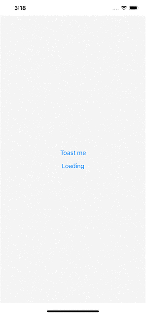

# Getting started

Base utility for mobile phone applicaion for android and ios




## Installation

```bash
yarn add react-native-eazy-background
```

## Usage

Wrap your application inside the background
```js
import Background from 'react-native-eazy-background';
function App () {
    return (
        <Background>{props.children}</Background>
    )
}
```

Use hook to show toase message
```js
import { useToast } from 'react-native-eazy-background';

function App () {
    const toast = useToast();
    return <Button title='toast me' onPress={() => toast('toast message') />
}
```

```js
import { useLoad, useToast } from 'react-native-eazy-background';

function App () {
    const loading = useLoad();
    const toast = useToast();
    useEffect = (() => {
        loading(true);
        toast('fetching data...', 'INFO');
        const data = await ...;
        ...
        toast('fetch success','SUCCESS');
        loading(false);
    })
}
```

Use Context inside the class
```js
import { ToastContext } from 'react-native-eazy-background';

class HomeScreen extends React.Component {

    static contextType = ToastContext;
    render() {
        return (
            <View>
                <Button title='toast me' 
                    onPress={() => {this.context.toastMessage('message', 'INFO')}}/>
            </View>
        );
    }
}
```


## Hooks

| Name        | Format                                      |
| ----------- | ------------------------------------------- |
| useToast    | useToast(String: message, String: Type)     |
| Toast Type  | SUCCESS, ERROR, INFO, WARNING               |
| useLoad     | useLoad(Boolean value)                      |


## Props 

| Name             | Tyoe      | Value                                             |
| ---------------- | --------- | ------------------------------------------------- |
| safeArea         | bool      | false                                             |
| barStyle         | string    | 'default' / 'light-content' / 'dark-content'      |
| barHidden        | bool      | true                                              |
| topColor         | string    | '#ffffff'                                         |
| bottomColor      | string    | '#000000'                                         |


## License
[MIT](https://choosealicense.com/licenses/mit/)